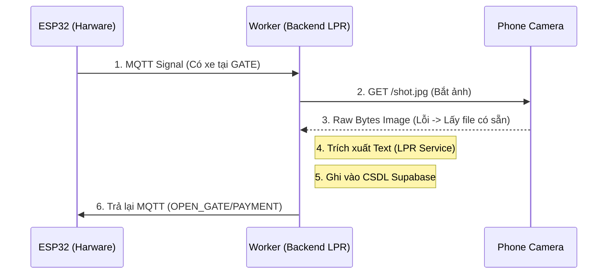

# KIẾN TRÚC HỆ THỐNG PARKING LPR (WORKER)

System LPR hiện tại hoạt động theo kiến trúc **MOM (Message-Oriented Middleware)** bằng giao thức **MQTT**, không sử dụng REST API truyền thống.

## 1. Cấu trúc Thư Mục

```text
parking-lpr/
├── main.py              # Đóng vai trò là Worker Event Loop, giữ file cấu trúc sống
├── gate_handler.py      # Bộ não trung tâm: Điều phối Camera -> AI OCR -> Logic tính toán DB -> Giao task xuống MQTT Command
├── mqtt_client.py       # Nhiệm vụ giao tiếp Mạng với Trạm phần cứng (ESP32)
├── camera_service.py    # Nhiệm vụ giao tiếp (HTTP) lấy hình qua camera điện thoại di động
├── lpr_service.py       # Lõi AI (PaddleOCR module) giúp bóc tách chữ từ ảnh
├── database.py          # Kết nối Database Supabase
├── mock_esp32.py        # Kịch bản kĩ thuật số mô phỏng Tín hiệu phần cứng (dành cho Test)
├── test-images/         # Kho ảnh Backup dùng khi IP Camera offline
└── requirements.txt
```

## 2. Luồng chạy Thực Tế (Data Flow)



## 3. Quản lý Life-Cycle
- Vì hệ thống xoá bỏ FastAPI, Vòng lặp chính của ứng dụng được duy trì thông qua `asyncio.sleep(1)` tại `main.py`.
- Tầng CSDL (Database) cũng được cấu hình Non-blocking (async) nhằm không che khuất luồng bắt hình thời gian thực của Camera.
